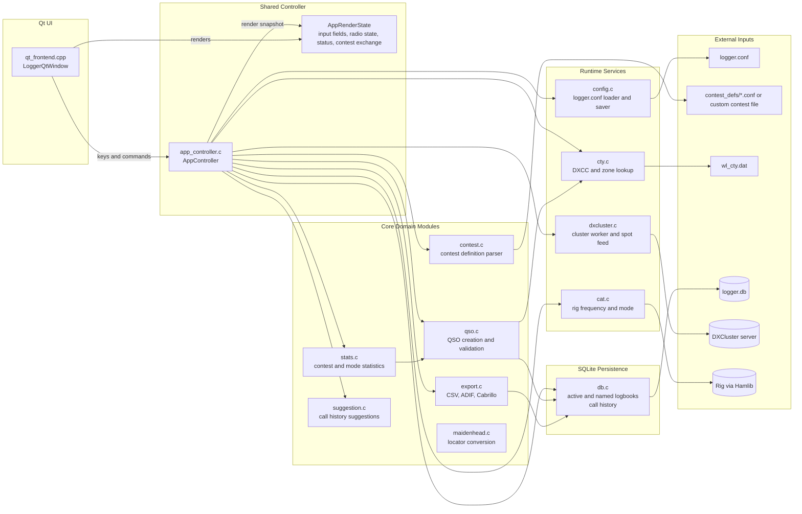
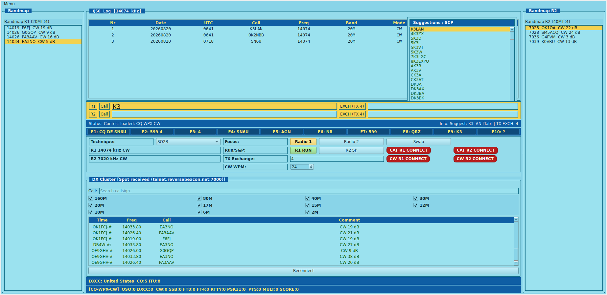

# Logger

Logger is an amateur radio logging application for entering QSOs, looking up DXCC information, and monitoring DXCluster spots.

The application uses shared controller/core logic, with Qt providing the user interface.

Dodatkowa dokumentacja:

- [docs/konfiguracja-i-zawody.md](docs/konfiguracja-i-zawody.md)
- [docs/klawiszologia.md](docs/klawiszologia.md)
- [docs/przykladowe-konfiguracje.md](docs/przykladowe-konfiguracje.md)
- [docs/sciaga-operatora.md](docs/sciaga-operatora.md)


## Architecture



Qt stays thin: it translates keyboard input into controller actions and paints the current `AppRenderState`.

`app_controller.c` is the orchestration layer. It owns contest-mode entry flow, dual-radio state, CAT integration, DXCluster lifecycle, export commands, CTY refresh, and named-logbook workflows while delegating storage and domain rules to the core modules.

Contest support is split cleanly: `contest.c` loads DXLog-like definitions, `app_controller.c` turns them into live entry behavior and sent-exchange generation, `qso.c` stores the resulting fields, and `export.c` produces Cabrillo from the same definition data.




## What it does

- Records QSOs from the Qt desktop UI
- Uses split entry fields: `call`, `rst`, `comments`
- Switches to contest entry mode with generated sent exchange when a contest definition is loaded
- Lets you set manual operating frequency by entering only digits in the call field
- Displays DXCC, CQ zone, and ITU zone information while typing a callsign
- Shows a dedicated callsign suggestions panel in the top-right corner with all matching history entries
- Connects to a DXCluster server, shows received spots in the cluster window, and stops the cluster worker cleanly when the app exits
- Tracks simple statistics
- Stores the QSO logbook and call history in SQLite
- Supports archived and named logbooks inside the same SQLite database
- Exports log data to CSV and ADIF files
- Exports contest logs to Cabrillo using a DXLog-like contest definition file
- Supports SO1R, SO2V, and SO2R operating techniques in configuration

## Features

- Split QSO entry with call/rst/comments and Space-based field cycling
- Contest entry flow with configurable exchange fields and incremental or static sent exchange
- CAT-aware frequency handling (live rig frequency when connected, manual fallback)
- Optional CAT-aware mode handling from the rig's current operating mode
- Per-radio focus, RUN/S&P state, and SO2R-aware controller state
- Callsign history suggestions with multi-match list view (top-right panel)
- Local DXCC lookup from a CTY database
- DXCluster status and spot display, with a stop-safe shutdown path
- Invalid QSO marking for export exclusion
- CSV/ADIF export support, including comments and custom ADIF filename
- Cabrillo export support (`exportcab`) with category metadata from contest definition
- DXLog-like contest definition parser (`contest <file>`) with field declarations
- Dual Hamlib CAT profiles for SO2R (`CAT_*` + `CAT2_*`)
- One-key CTY database update from the internet
- SQLite-backed logbook and call-history storage with `LOGGER_DB_PATH` override
- New clean log action to truncate the current SQLite logbook and history
- Independent named logbooks stored in SQLite, with selection by ID or name
- New-log flow with optional contest preset selection in the Qt UI

## Requirements

- C compiler (GCC or Clang)
- CMake
- make
- pthread support
- curl or wget (for CTY database download)

Optional for GUI frontend:

- Qt Widgets development package (Qt 5 or Qt 6)
- Hamlib development package (for CAT support)

On Debian/Ubuntu systems, install the required packages with:

```bash
sudo apt-get update
sudo apt-get install -y build-essential cmake
```

## Build

From the project root:

```bash
cmake -S . -B build
cmake --build build
```

Executables are created in the build directory:

- logger (GUI)

## Regression Tests

The project includes a regression suite in `tests/regression` that validates
core non-UI behavior:

- configuration parsing and defaults
- CTY database loading and callsign lookup
- QSO parsing, band/mode detection, and invalid toggle behavior
- statistics aggregation
- CSV and ADIF export content
- Maidenhead locator conversion

Run the tests with:

```bash
cmake -S . -B build
cmake --build build
ctest --test-dir build --output-on-failure
```

## Unit Tests

The project also includes unit tests in `tests/unit` to verify exported
non-UI functions from core modules:

- `app_controller`: shared frontend-independent key/state flow used by the Qt frontend
- `config`: `config_load`
- `cty`: `cty_load`, `cty_lookup`
- `qso`: `qso_init`, `qso_add`, `qso_mark_invalid`, `detect_band`, `detect_mode`
- `stats`: `stats_update`
- `export`: `export_csv`, `export_adif`
- `maidenhead`: `locator_to_latlon`
- `dxcluster`: `dxcluster_set_status`

UI rendering itself is intentionally not covered by automated tests and should
be verified manually.

Run all tests (regression + unit):

```bash
cmake -S . -B build
cmake --build build
ctest --test-dir build --output-on-failure
```

## Run

```bash
cd build
./logger
```

## Notes

- The application is intended for desktop environments.

## Configuration

The application reads a configuration file named logger.conf from the working directory.

Example configuration:

```ini
LAT=21.104127
LON=37.300154
LOCATOR=AA00AA

DXC_HOST=dx.da0bcc.de
DXC_PORT=7300
DXC_CALL=AAXAAA
```

### Configuration and contest definitions

Detailed field-by-field documentation is in [docs/konfiguracja-i-zawody.md](docs/konfiguracja-i-zawody.md).

Ready-to-use examples for `SO1R`, `SO2V`, and `SO2R` are in [docs/przykladowe-konfiguracje.md](docs/przykladowe-konfiguracje.md).

Short rules worth remembering:

- `CONTEST_DEF_FILE` may point to a local file or a preset in `contest_defs/`
- `EXCHANGE_SENT=#` always means incremental serials `1`, `2`, `3`...
- `CONTEST_TX_EXCHANGE` only applies to static sent exchanges and is ignored for `EXCHANGE_SENT=#`

## Operation

Full keyboard and workflow documentation is in [docs/klawiszologia.md](docs/klawiszologia.md).

For daily use, the shortest version is in [docs/sciaga-operatora.md](docs/sciaga-operatora.md).

Most important operational rules:

- `F1..F10` send CW messages defined in `cw_keys.ini`
- `Ctrl+F2` creates a new log and can immediately assign a contest preset
- `Space` moves between visible input fields, it does not insert a literal space into the entry line
- in contest mode you enter `Call` and received `Exchange`, while sent exchange is generated from the contest definition
- callsign suggestions are shown only while editing the first field and can be accepted with `Tab` or `Space`

## Data files

The program expects the DXCC database file named wl_cty.dat in the working directory or in the build directory.

When F7 is used, wl_cty.dat is downloaded and replaced in the current working directory.

The QSO logbook and call history are stored in `logger.db` by default. Set
`LOGGER_DB_PATH` to point at a different SQLite file if you want to keep the
database elsewhere. The first run imports existing `call_history.txt` entries
into SQLite if the database is empty.

`logger.conf` and `wl_cty.dat` remain text-based files.

## Notes

- The application uses Qt Widgets, so it is intended for desktop environments.
- DXCluster connectivity depends on the configured host, port, and network access.
- If you want to use a different DXCluster server, update DXC_HOST and DXC_PORT in logger.conf.
- Closing the application runs the shared shutdown path, which stops the DXCluster worker thread before the database is closed.
