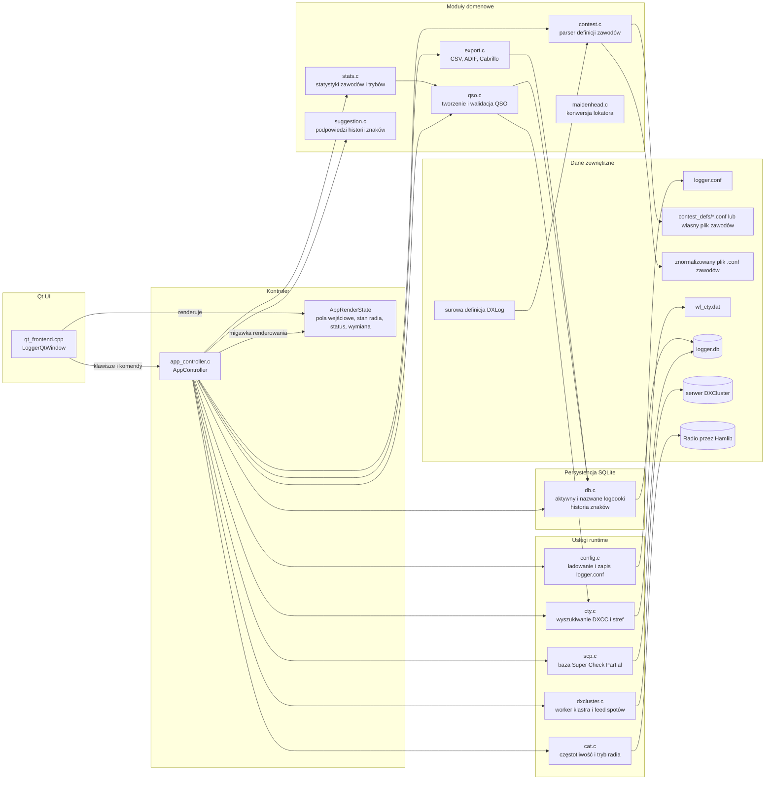
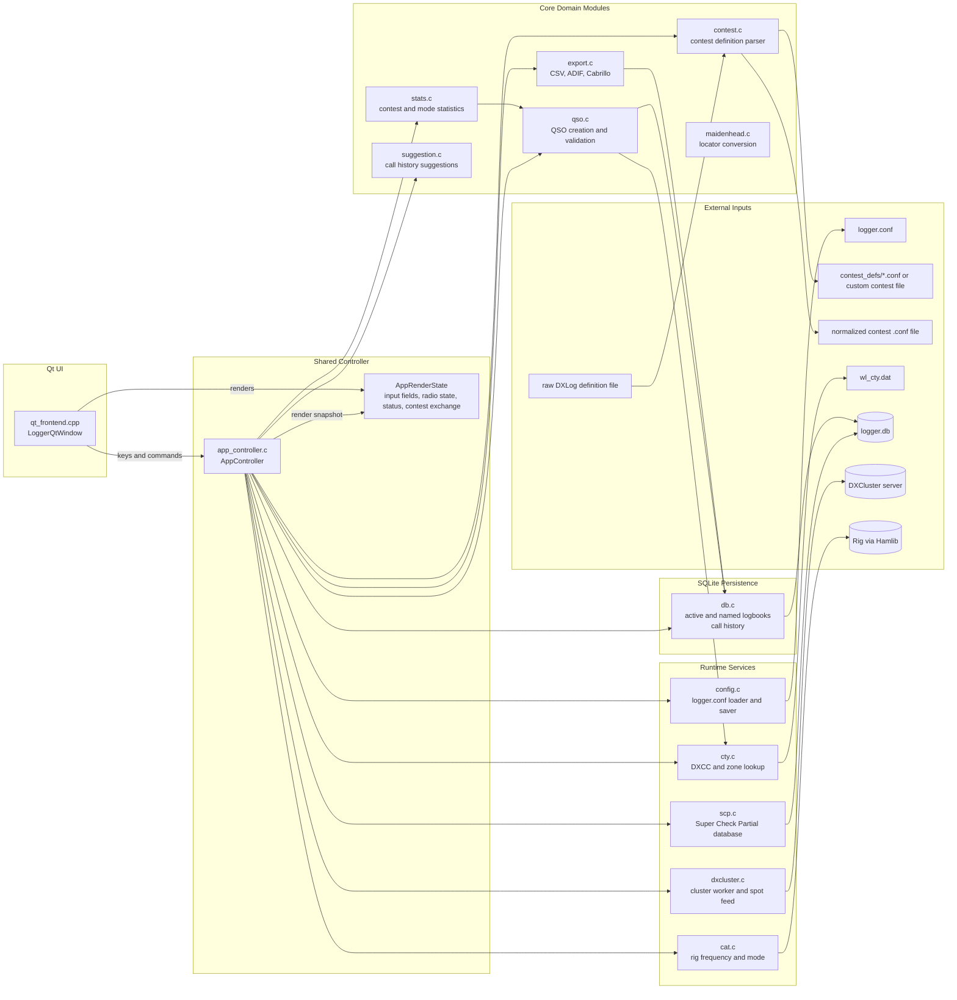

# LCL Logger

LCL Logger to aplikacja do prowadzenia logu zawodów krótkofalarskich. Aplikacja opiera się na współdzielonej logice kontrolera, z framework Qt jako warstwą interfejsu użytkownika.

Dodatkowa dokumentacja:

- [docs/architektura.md](docs/architektura.md)
- [docs/konfiguracja-i-zawody.md](docs/konfiguracja-i-zawody.md)
- [docs/klawiszologia.md](docs/klawiszologia.md)
- [docs/przykladowe-konfiguracje.md](docs/przykladowe-konfiguracje.md)
- [docs/sciaga-operatora.md](docs/sciaga-operatora.md)
- [docs/siec-centralny-log.md](docs/siec-centralny-log.md)


## Architektura



Qt pozostaje cienką warstwą: tłumaczy wejście klawiatury na akcje kontrolera i rysuje aktualny `AppRenderState`.

`app_controller.c` to warstwa orkiestracji. Zarządza trybem contestowym, stanem dual-radio, integracją CAT, cyklem życia DXCluster, komendami eksportu, odświeżaniem CTY i operacjami na nazwanych logbookach, delegując przechowywanie danych i reguły domenowe do modułów głównych.

Obsługa zawodów jest podzielona czysto: `contest.c` wczytuje definicje w stylu DXLog, `app_controller.c` przekształca je w aktywne zachowanie wpisywania i generowanie nadawanej wymiany, `qso.c` zapisuje wynikowe pola, a `export.c` produkuje Cabrillo oraz ADIF z tych samych danych definicji.


## Co robi aplikacja

- Rejestruje QSO z desktopowego interfejsu Qt
- Używa podzielonych pól wpisywania: `call`, `exch`
- Przełącza się w tryb contestowy z generowaną nadawaną wymianą po załadowaniu definicji zawodów
- Umożliwia ręczne ustawienie częstotliwości przez wpisanie samych cyfr w polu `call`
- Wyświetla informacje DXCC, strefę CQ i ITU podczas wpisywania znaku
- Pokazuje panel „Suggestions / SCP" w prawym górnym rogu tabeli logów, łączący dopasowania z historii znaków (ciemnożółty) i z bazy Super Check Partial (ciemnozielony) w jednej liście
- Pobiera i ładuje bazę Super Check Partial (`MASTER.SCP`) z supercheckpartial.com do wyszukiwania check partial w czasie rzeczywistym
- Pokazuje panel wiadomości CW między paskiem statusu a panelem DXCC — F1–F10 jako klikalne przyciski z rozwiniętym tekstem wiadomości dla aktualnego trybu RUN/S&P; kliknięcie wysyła wiadomość przez keyer
- Łączy się z serwerem DXCluster, pokazuje odebrane spoty w oknie klastra i czysto zatrzymuje workera klastra przy zamknięciu aplikacji
- Pokazuje listę bandmapy dla bieżącego pasma (spoty posortowane po częstotliwości) z szybkim "grab spot"
- Bandmapa automatycznie pomija bliskie duplikaty tego samego znaku na bardzo zbliżonych częstotliwościach (tolerancja 2kHz)
- Śledzi proste statystyki
- Przechowuje log QSO i historię znaków w SQLite
- Obsługuje archiwalne i nazwane logbooki w tej samej bazie SQLite
- Eksportuje dane logu do plików CSV i ADIF
- Eksportuje log contestowy do Cabrillo z użyciem definicji zawodów w stylu DXLog
- Importuje surowe definicje DXLog i normalizuje je do lokalnego formatu zawodów
- Obsługuje zasady wymiany QTC w stylu WAE z konfigurowalną stroną nadawczą i punktacją za QTC (wciąż w trakcie testowania)
- Obsługuje techniki operatorskie SO1R, SO2V i SO2R
- Automatycznie przywraca zapisaną definicję zawodów przy ponownym otwarciu archiwalnego lub nazwanego logbooka
- Utrwala ścieżkę definicji zawodów per logbook i odtwarza aktywny stan kontestu bez ręcznej re-selekcji
- Aktualizuje prędkość keyera CW natychmiast przez kontrolkę runtime w głównym oknie
- Używa jednego menu głównego z pogrupowanymi akcjami

## Funkcjonalności

- Scalony panel „Suggestions / SCP": podpowiedzi historii znaków (ciemnożółty) i dopasowania SCP (ciemnozielony) w jednej liście
- Pobieranie bazy SCP z supercheckpartial.com przez akcję menu „Update SCP (Check Partial)"
- Klikalne przyciski wiadomości CW (F1–F10) w dedykowanym panelu między paskiem statusu a DXCC; tekst pokazuje rozwiniętą wiadomość dla aktywnego trybu RUN/S&P
- Podzielone wpisywanie QSO z polami call/rst/comments i przechodzeniem przez Spację
- Tryb contestowy z konfigurowalnymi polami wymiany i inkrementalną lub statyczną nadawaną wymianą
- Obsługa częstotliwości z uwzględnieniem CAT (żywa częstotliwość radia przy połączeniu, ręczny fallback)
- Opcjonalne pobieranie trybu pracy z bieżącego trybu radia przez CAT
- Stan per-radio: fokus, RUN/S&P, kontroler SO2R
- Lokalne wyszukiwanie DXCC z bazy CTY
- Wyświetlanie statusu i spotów DXCluster z bezpieczną ścieżką zatrzymania
- Nawigacja po bandmapie klawiaturą (`Ctrl+Up`/`Ctrl+Down`) i strojenie na aktywację spotu
- Oznaczanie nieprawidłowych QSO do wykluczenia z eksportu
- Eksport CSV/ADIF z komentarzami i własną nazwą pliku ADIF
- Eksport Cabrillo (`exportcab`) z metadanymi kategorii z definicji zawodów
- Parser definicji zawodów w stylu DXLog (`contest <plik>`) z deklaracjami pól
- Import surowych definicji DXLog do znormalizowanego lokalnego formatu
- Obsługa punktacji QTC dla zawodów WAE przez `QTC_SENDER` i `POINTS_PER_QTC`
- Podwójne profile CAT Hamlib dla SO2R (`CAT_*` + `CAT2_*`)
- Stałe odznaki połączenia CAT/CW obok kontrolek RUN/S&P (`CAT ON/OFF`, `CW ON/OFF`)
- Przełączanie widoczności panelu konfiguracji CAT/CW z menu (`Show CAT/CW Config`)
- Globalny skrót `Ctrl+F9` do pokazywania/ukrywania panelu CAT/CW
- Jednoklawiszowa aktualizacja bazy CTY z internetu
- Aktualizacja bazy SCP z supercheckpartial.com (`Menu → Update SCP (Check Partial)`)
- Logbook i historia znaków w SQLite z nadpisaniem ścieżki przez `LOGGER_DB_PATH`
- Akcja tworzenia nowego pustego logu
- Niezależne nazwane logbooki w SQLite, wybierane po ID lub nazwie
- Tworzenie nowego logu z opcjonalnym wyborem presetu zawodów w UI Qt
- Dialog konfiguracji zawodów z zapisem do pliku i dedykowanym skrótem (`Ctrl+F8`)

## Wymagania

- Kompilator C (GCC lub Clang)
- CMake
- make
- obsługa wątków pthread
- curl lub wget (do pobierania baz CTY i SCP)

Opcjonalnie dla frontendu GUI:

- pakiet deweloperski Qt Widgets (Qt 5 lub Qt 6)
- pakiet deweloperski Hamlib (dla obsługi CAT)

Na systemach Debian/Ubuntu zainstaluj wymagane pakiety:

```bash
sudo apt-get update
sudo apt-get install -y build-essential cmake
```

## Budowanie

Z katalogu głównego projektu:

```bash
cmake -S . -B build
cmake --build build
```

Pliki wykonywalne są tworzone w katalogu `build`:

- `logger` (GUI)

## Testy regresji

Projekt zawiera zestaw testów regresji w `tests/regression` weryfikujący podstawowe zachowanie poza UI:

- parsowanie konfiguracji i wartości domyślne
- ładowanie bazy CTY i wyszukiwanie znaków
- parsowanie QSO, wykrywanie pasma/trybu i przełączanie flagi invalid
- agregację statystyk
- zawartość eksportów CSV i ADIF
- konwersję lokatora Maidenhead

Uruchomienie testów:

```bash
cmake -S . -B build
cmake --build build
ctest --test-dir build --output-on-failure
```

## Testy jednostkowe

Projekt zawiera też testy jednostkowe w `tests/unit` weryfikujące eksportowane funkcje modułów poza UI:

- `app_controller`: wspólny przepływ klawiszy/stanu niezależny od frontendu
- `config`: `config_load`
- `cty`: `cty_load`, `cty_lookup`
- `qso`: `qso_init`, `qso_add`, `qso_mark_invalid`, `detect_band`, `detect_mode`
- `stats`: `stats_update`
- `export`: `export_csv`, `export_adif`
- `maidenhead`: `locator_to_latlon`
- `dxcluster`: `dxcluster_set_status`

Renderowanie UI nie jest pokryte automatycznymi testami i powinno być weryfikowane ręcznie.

Uruchomienie wszystkich testów (regresja + jednostkowe):

```bash
cmake -S . -B build
cmake --build build
ctest --test-dir build --output-on-failure
```

## Uruchomienie

```bash
cd build
./logger
```

## Konfiguracja

Aplikacja odczytuje plik konfiguracyjny `logger.conf` z bieżącego katalogu roboczego.

Przykładowa konfiguracja:

```ini
LAT=21.104127
LON=37.300154
LOCATOR=AA00AA

DXC_HOST=dx.da0bcc.de
DXC_PORT=7300
DXC_CALL=AAXAAA
```

### Konfiguracja i definicje zawodów

Szczegółowa dokumentacja pól: [docs/konfiguracja-i-zawody.md](docs/konfiguracja-i-zawody.md).

Gotowe przykłady dla `SO1R`, `SO2V` i `SO2R`: [docs/przykladowe-konfiguracje.md](docs/przykladowe-konfiguracje.md).

Najważniejsze zasady:

- `CONTEST_DEF_FILE` może wskazywać lokalny plik lub preset z `contest_defs/`
- `EXCHANGE_SENT=#` zawsze oznacza numerację inkrementalną `1`, `2`, `3`...
- `CONTEST_TX_EXCHANGE` dotyczy tylko statycznej nadawanej wymiany i jest ignorowany przy `EXCHANGE_SENT=#`

## Obsługa

Pełna dokumentacja skrótów klawiszowych i workflow: [docs/klawiszologia.md](docs/klawiszologia.md).

Najkrótsza wersja do codziennej pracy: [docs/sciaga-operatora.md](docs/sciaga-operatora.md).

Najważniejsze zasady operacyjne:

- `F1..F10` wysyłają wiadomości CW zdefiniowane w `cw_keys.ini`; klawisze są też wyświetlane jako klikalne przyciski w panelu między statusem a DXCC
- `Ctrl+F2` tworzy nowy log i umożliwia przypisanie presetu zawodów
- `Ctrl+F8` otwiera dialog konfiguracji zawodów
- `Ctrl+F9` pokazuje lub ukrywa panel konfiguracji CAT/CW
- `Ctrl+Up` i `Ctrl+Down` przechodzą do poprzedniego/następnego spotu na bandmapie bieżącego pasma i stroją częstotliwość
- `Menu → Show CAT/CW Config` pokazuje lub ukrywa panel konfiguracji CAT/CW
- stan połączeń CAT i CW jest zawsze widoczny jako dwie odznaki obok kontrolek RUN/S&P
- `Spacja` przechodzi między widocznymi polami wejściowymi, nie wstawia spacji do wpisywanej linii
- w trybie contestowym wpisujesz `Call` i odebraną `Exchange`, a nadawana wymiana jest generowana z definicji zawodów
- panel „Suggestions / SCP" pokazuje podpowiedzi z historii (ciemnożółty) i dopasowania SCP (ciemnozielony); `Tab` lub `Spacja` wstawiają zaznaczoną pozycję z historii
- `contest import <plik_dxlog> [plik_wyjściowy]` importuje surową definicję DXLog do znormalizowanego lokalnego formatu (domyślny plik wyjściowy: `contest.conf`) i ładuje ją natychmiast
- `contest import-only <plik_dxlog> [plik_wyjściowy]` importuje i zapisuje znormalizowany plik bez ładowania i bez zmiany aktywnego `CONTEST_DEF_FILE`
- po imporcie szczegóły ostrzeżeń o ignorowanych regułach DXLog są wyświetlane w linii informacyjnej

## Pliki danych

Program oczekuje pliku bazy DXCC o nazwie `wl_cty.dat` w bieżącym katalogu roboczym lub w katalogu build. Po naciśnięciu `Ctrl+F7` plik `wl_cty.dat` jest pobierany i zastępowany w bieżącym katalogu roboczym.

Log QSO i historia znaków są przechowywane domyślnie w `logger.db`. Ustaw `LOGGER_DB_PATH` na inny plik SQLite, jeśli chcesz trzymać bazę w innym miejscu. Przy pierwszym uruchomieniu istniejące wpisy z `call_history.txt` są importowane do SQLite, jeśli baza jest pusta.

Baza Super Check Partial jest przechowywana w pliku `MASTER.SCP` w bieżącym katalogu roboczym. Pobierz lub zaktualizuj ją przez `Menu → Update SCP (Check Partial)` albo ręcznie z https://www.supercheckpartial.com/downloads/MASTER.SCP. Wyszukiwanie check partial aktywuje się po wpisaniu co najmniej 2 znaków w polu `call`.

Pliki `logger.conf` i `wl_cty.dat` pozostają plikami tekstowymi.

## Uwagi

- Aplikacja używa Qt Widgets, więc jest przeznaczona dla środowisk desktopowych.
- Łączność z DXCluster zależy od skonfigurowanego hosta, portu i dostępu do sieci.
- Zamknięcie aplikacji uruchamia wspólną ścieżkę wyłączania, która zatrzymuje wątek workera DXCluster przed zamknięciem bazy danych.

Logger is an amateur radio logging application for entering QSOs, looking up DXCC information, and monitoring DXCluster spots.

The application uses shared controller/core logic, with Qt providing the user interface.

Dodatkowa dokumentacja:

- [docs/architektura.md](docs/architektura.md)
- [docs/konfiguracja-i-zawody.md](docs/konfiguracja-i-zawody.md)
- [docs/klawiszologia.md](docs/klawiszologia.md)
- [docs/przykladowe-konfiguracje.md](docs/przykladowe-konfiguracje.md)
- [docs/sciaga-operatora.md](docs/sciaga-operatora.md)
- [docs/siec-centralny-log.md](docs/siec-centralny-log.md)


## Architecture



Qt stays thin: it translates keyboard input into controller actions and paints the current `AppRenderState`.

`app_controller.c` is the orchestration layer. It owns contest-mode entry flow, dual-radio state, CAT integration, DXCluster lifecycle, export commands, CTY refresh, and named-logbook workflows while delegating storage and domain rules to the core modules.

Contest support is split cleanly: `contest.c` loads DXLog-like definitions, `app_controller.c` turns them into live entry behavior and sent-exchange generation, `qso.c` stores the resulting fields, and `export.c` produces Cabrillo from the same definition data.


## What it does

- Records QSOs from the Qt desktop UI
- Uses split entry fields: `call`, `rst`, `comments`
- Switches to contest entry mode with generated sent exchange when a contest definition is loaded
- Lets you set manual operating frequency by entering only digits in the call field
- Displays DXCC, CQ zone, and ITU zone information while typing a callsign
- Shows a "Suggestions / SCP" panel in the top-right corner combining call history matches (dark yellow) and Super Check Partial database matches (dark green) in a single list
- Downloads and loads the Super Check Partial database (`MASTER.SCP`) from supercheckpartial.com for real-time check partial lookup while typing a callsign
- Shows a CW message panel between the status bar and the DXCC panel with F1–F10 as clickable buttons showing the expanded message text for the current RUN/S&P mode; clicking sends the message via the CW keyer
- Connects to a DXCluster server, shows received spots in the cluster window, and stops the cluster worker cleanly when the app exits
- Shows a bandmap list for current band (spots sorted by frequency) with quick tuning on double-click
- Bandmap automatically suppresses near-duplicate entries for the same callsign on very close frequencies
- Tracks simple statistics
- Stores the QSO logbook and call history in SQLite
- Supports archived and named logbooks inside the same SQLite database
- Exports log data to CSV and ADIF files
- Exports contest logs to Cabrillo using a DXLog-like contest definition file
- Imports raw DXLog contest definitions and normalizes them to the local contest format
- Supports WAE-style QTC exchange rules with configurable sender side and points-per-QTC scoring
- Supports SO1R, SO2V, and SO2R operating techniques in configuration
- Restores the saved contest definition automatically when an archived or named logbook is reopened
- Persists the contest-definition path per logbook and rehydrates the active contest state without manual re-selection
- Stores the received exchange in the QSO row and preserves the next serial value from the existing log instead of UI state
- Updates CW keyer speed immediately with a live runtime control in the main window
- Uses one top-level menu with grouped actions (instead of multiple menu groups and toolbar buttons)

## Features

- Callsign history suggestions merged with Super Check Partial (SCP) in a single "Suggestions / SCP" panel; history entries shown in dark yellow, SCP-only matches in dark green
- SCP database download from supercheckpartial.com via menu action "Update SCP (Check Partial)"
- Clickable CW message buttons (F1–F10) in a dedicated panel between status bar and DXCC; text shows the expanded message for the active RUN/S&P mode
- Split QSO entry with call/rst/comments and Space-based field cycling
- Contest entry flow with configurable exchange fields and incremental or static sent exchange
- CAT-aware frequency handling (live rig frequency when connected, manual fallback)
- Optional CAT-aware mode handling from the rig's current operating mode
- Per-radio focus, RUN/S&P state, and SO2R-aware controller state
- Callsign history suggestions with multi-match list view (top-right panel)
- Local DXCC lookup from a CTY database
- DXCluster status and spot display, with a stop-safe shutdown path
- Bandmap navigation from keyboard (`Ctrl+Up`/`Ctrl+Down`) and frequency tune on spot activation
- Invalid QSO marking for export exclusion
- CSV/ADIF export support, including comments and custom ADIF filename
- Cabrillo export support (`exportcab`) with category metadata from contest definition
- DXLog-like contest definition parser (`contest <file>`) with field declarations
- Raw DXLog import flow that converts legacy definitions into the normalized local contest format
- QTC scoring support for WAE-style contests via `QTC_SENDER` and `POINTS_PER_QTC`
- Dual Hamlib CAT profiles for SO2R (`CAT_*` + `CAT2_*`)
- Permanent CAT/CW connection badges near RUN/S&P controls (`CAT ON/OFF`, `CW ON/OFF`)
- CAT/CW configuration panel visibility toggle from menu (`Show CAT/CW Config`)
- Global shortcut `Ctrl+F9` for CAT/CW panel show/hide toggle
- One-key CTY database update from the internet
- SCP database update from supercheckpartial.com (`Menu → Update SCP (Check Partial)`)
- SQLite-backed logbook and call-history storage with `LOGGER_DB_PATH` override
- New clean log action to truncate the current SQLite logbook and history
- Independent named logbooks stored in SQLite, with selection by ID or name
- New-log flow with optional contest preset selection in the Qt UI
- Contest configuration dialog with save-to-file flow and dedicated shortcut (`Ctrl+F8`)

## Requirements

- C compiler (GCC or Clang)
- CMake
- make
- pthread support
- curl or wget (for CTY database download)

Optional for GUI frontend:

- Qt Widgets development package (Qt 5 or Qt 6)
- Hamlib development package (for CAT support)

On Debian/Ubuntu systems, install the required packages with:

```bash
sudo apt-get update
sudo apt-get install -y build-essential cmake
```

## Build

From the project root:

```bash
cmake -S . -B build
cmake --build build
```

Executables are created in the build directory:

- logger (GUI)

## Regression Tests

The project includes a regression suite in `tests/regression` that validates
core non-UI behavior:

- configuration parsing and defaults
- CTY database loading and callsign lookup
- QSO parsing, band/mode detection, and invalid toggle behavior
- statistics aggregation
- CSV and ADIF export content
- Maidenhead locator conversion

Run the tests with:

```bash
cmake -S . -B build
cmake --build build
ctest --test-dir build --output-on-failure
```

## Unit Tests

The project also includes unit tests in `tests/unit` to verify exported
non-UI functions from core modules:

- `app_controller`: shared frontend-independent key/state flow used by the Qt frontend
- `config`: `config_load`
- `cty`: `cty_load`, `cty_lookup`
- `qso`: `qso_init`, `qso_add`, `qso_mark_invalid`, `detect_band`, `detect_mode`
- `stats`: `stats_update`
- `export`: `export_csv`, `export_adif`
- `maidenhead`: `locator_to_latlon`
- `dxcluster`: `dxcluster_set_status`

UI rendering itself is intentionally not covered by automated tests and should
be verified manually.

Run all tests (regression + unit):

```bash
cmake -S . -B build
cmake --build build
ctest --test-dir build --output-on-failure
```

## Run

```bash
cd build
./logger
```

## Notes

- The application is intended for desktop environments.

## Configuration

The application reads a configuration file named logger.conf from the working directory.

Example configuration:

```ini
LAT=21.104127
LON=37.300154
LOCATOR=AA00AA

DXC_HOST=dx.da0bcc.de
DXC_PORT=7300
DXC_CALL=AAXAAA
```

### Configuration and contest definitions

Detailed field-by-field documentation is in [docs/konfiguracja-i-zawody.md](docs/konfiguracja-i-zawody.md).

Ready-to-use examples for `SO1R`, `SO2V`, and `SO2R` are in [docs/przykladowe-konfiguracje.md](docs/przykladowe-konfiguracje.md).

Short rules worth remembering:

- `CONTEST_DEF_FILE` may point to a local file or a preset in `contest_defs/`
- `EXCHANGE_SENT=#` always means incremental serials `1`, `2`, `3`...
- `CONTEST_TX_EXCHANGE` only applies to static sent exchanges and is ignored for `EXCHANGE_SENT=#`

## Operation

Full keyboard and workflow documentation is in [docs/klawiszologia.md](docs/klawiszologia.md).

For daily use, the shortest version is in [docs/sciaga-operatora.md](docs/sciaga-operatora.md).

Most important operational rules:

- `F1..F10` send CW messages defined in `cw_keys.ini`
- `Ctrl+F2` creates a new log and can immediately assign a contest preset
- `Ctrl+F8` opens the contest configuration dialog
- `Ctrl+F9` shows or hides CAT/CW configuration panel
- `Ctrl+Up` and `Ctrl+Down` move to previous/next spot on current-band bandmap and tune frequency
- `Menu -> Show CAT/CW Config` shows or hides CAT/CW configuration panel
- CAT and CW link state is always visible as two lamp-style badges near RUN/S&P
- `Space` moves between visible input fields, it does not insert a literal space into the entry line
- in contest mode you enter `Call` and received `Exchange`, while sent exchange is generated from the contest definition
- callsign suggestions are shown only while editing the first field and can be accepted with `Tab` or `Space`
- `contest import <dxlog_file> [output_conf]` imports a raw DXLog definition into a normalized local contest config (default output: `contest.conf`) and loads it immediately
- `contest import-only <dxlog_file> [output_conf]` imports and writes the normalized file without loading it and without changing active `CONTEST_DEF_FILE`
- after import, warning details about ignored DXLog-only rules are shown in the info line

## Data files

The program expects the DXCC database file named wl_cty.dat in the working directory or in the build directory.

When F7 is used, wl_cty.dat is downloaded and replaced in the current working directory.

The QSO logbook and call history are stored in `logger.db` by default. Set
`LOGGER_DB_PATH` to point at a different SQLite file if you want to keep the
database elsewhere. The first run imports existing `call_history.txt` entries
into SQLite if the database is empty.

The Super Check Partial database is stored in `MASTER.SCP` in the working
directory. Download or update it via `Menu → Update SCP (Check Partial)` or
manually from https://www.supercheckpartial.com/downloads/MASTER.SCP.
Check partial search activates when at least two characters are typed in the
call field.

`logger.conf` and `wl_cty.dat` remain text-based files.

## Notes

- The application uses Qt Widgets, so it is intended for desktop environments.
- DXCluster connectivity depends on the configured host, port, and network access.
- If you want to use a different DXCluster server, update DXC_HOST and DXC_PORT in logger.conf.
- Closing the application runs the shared shutdown path, which stops the DXCluster worker thread before the database is closed.
