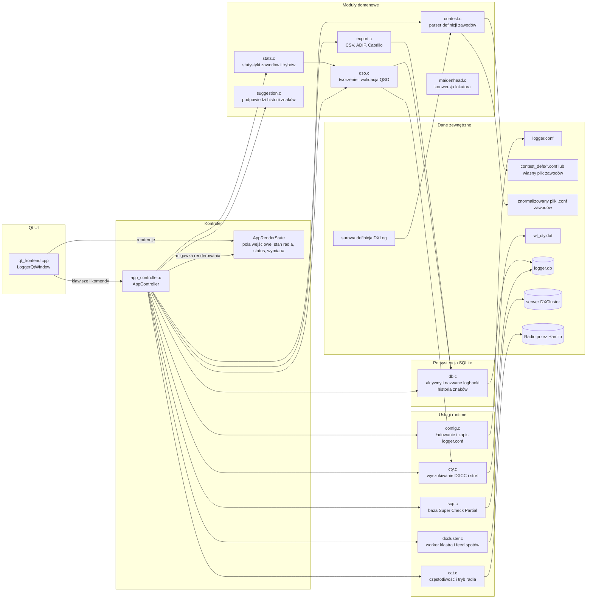
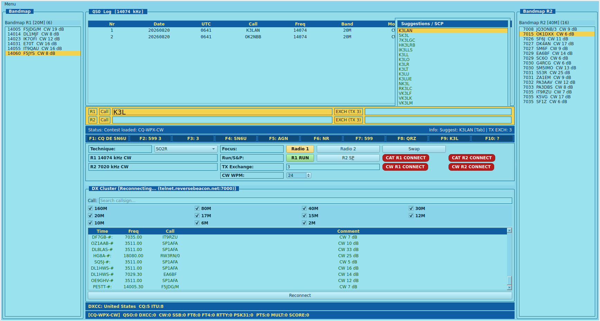

# LCL Logger

LCL Logger to aplikacja do prowadzenia logu zawodów krótkofalarskich. Aplikacja opiera się na współdzielonej logice kontrolera, z framework Qt jako warstwą interfejsu użytkownika.

Dodatkowa dokumentacja:

- [docs/architektura.md](docs/architektura.md)
- [docs/konfiguracja-i-zawody.md](docs/konfiguracja-i-zawody.md)
- [docs/klawiszologia.md](docs/klawiszologia.md)
- [docs/przykladowe-konfiguracje.md](docs/przykladowe-konfiguracje.md)
- [docs/sciaga-operatora.md](docs/sciaga-operatora.md)
- [docs/siec-centralny-log.md](docs/siec-centralny-log.md)
- [docs/siec-centralny-log-projekt.md](docs/siec-centralny-log-projekt.md)

## Status pracy sieciowej

Topologia gwiazdy z centralnym logiem jest już zaimplementowana w kodzie, a nie tylko opisana w dokumentacji. Aktualny model obejmuje:

- serwer centralny z nasłuchiwaniem TCP oraz sesjami klienta,
- klienta z lokalnym outboxem, retry/backoff i synchronizacją catch-up,
- globalny dziennik operacji, `station_seq` i `global_seq`,
- centralną rezerwację seriali contestowych oraz walidację logbooków,
- utrwalanie identyfikatora `qso_uid` i odrzucanie konfliktów duplikatów,
- opcjonalne TLS i mechanizmy limitowania ruchu oraz timeoutów sesji,
- testy regresyjne i jednostkowe uruchamiane w WSL.

Implementacja jest już dostatecznie dojrzała, aby traktować ten dokument jako opis aktualnego działania systemu, a nie wyłącznie planu rozwoju.

## Architektura



Qt pozostaje cienką warstwą: tłumaczy wejście klawiatury na akcje kontrolera i rysuje aktualny `AppRenderState`.

`app_controller.c` to warstwa orkiestracji. Zarządza trybem contestowym, stanem dual-radio, integracją CAT, cyklem życia DXCluster, komendami eksportu, odświeżaniem CTY i operacjami na nazwanych logbookach, delegując przechowywanie danych i reguły domenowe do modułów głównych.

Obsługa zawodów jest podzielona czysto: `contest.c` wczytuje definicje w stylu DXLog, `app_controller.c` przekształca je w aktywne zachowanie wpisywania i generowanie nadawanej wymiany, `qso.c` zapisuje wynikowe pola, a `export.c` produkuje Cabrillo oraz ADIF z tych samych danych definicji.




## Co robi aplikacja

- Rejestruje QSO z desktopowego interfejsu Qt
- Używa podzielonych pól wpisywania: `call`, `exch`
- Przełącza się w tryb contestowy z generowaną nadawaną wymianą po załadowaniu definicji zawodów
- Umożliwia ręczne ustawienie częstotliwości przez wpisanie samych cyfr w polu `call`
- Wyświetla informacje DXCC, strefę CQ i ITU podczas wpisywania znaku
- Pokazuje panel „Suggestions / SCP" w prawym górnym rogu tabeli logów, łączący dopasowania z historii znaków (ciemnożółty) i z bazy Super Check Partial (ciemnozielony) w jednej liście
- Pobiera i ładuje bazę Super Check Partial (`MASTER.SCP`) z supercheckpartial.com do wyszukiwania check partial w czasie rzeczywistym
- Pokazuje panel wiadomości CW między paskiem statusu a panelem DXCC — F1–F10 jako klikalne przyciski z rozwiniętym tekstem wiadomości dla aktualnego trybu RUN/S&P; kliknięcie wysyła wiadomość przez keyer
- Łączy się z serwerem DXCluster, pokazuje odebrane spoty w oknie klastra i czysto zatrzymuje workera klastra przy zamknięciu aplikacji
- Pokazuje listę bandmapy dla bieżącego pasma (spoty posortowane po częstotliwości) z szybkim "grab spot"
- Bandmapa automatycznie pomija bliskie duplikaty tego samego znaku na bardzo zbliżonych częstotliwościach (tolerancja 2kHz)
- Śledzi proste statystyki
- Przechowuje log QSO i historię znaków w SQLite
- Obsługuje archiwalne i nazwane logbooki w tej samej bazie SQLite
- Eksportuje dane logu do plików CSV i ADIF
- Eksportuje log contestowy do Cabrillo z użyciem definicji zawodów w stylu DXLog
- Importuje surowe definicje DXLog i normalizuje je do lokalnego formatu zawodów
- Obsługuje zasady wymiany QTC w stylu WAE z konfigurowalną stroną nadawczą i punktacją za QTC (wciąż w trakcie testowania)
- Obsługuje techniki operatorskie SO1R, SO2V i SO2R
- Automatycznie przywraca zapisaną definicję zawodów przy ponownym otwarciu archiwalnego lub nazwanego logbooka
- Utrwala ścieżkę definicji zawodów per logbook i odtwarza aktywny stan kontestu bez ręcznej re-selekcji
- Aktualizuje prędkość keyera CW natychmiast przez kontrolkę runtime w głównym oknie
- Używa jednego menu głównego z pogrupowanymi akcjami

## Funkcjonalności

- Scalony panel „Suggestions / SCP": podpowiedzi historii znaków (ciemnożółty) i dopasowania SCP (ciemnozielony) w jednej liście
- Pobieranie bazy SCP z supercheckpartial.com przez akcję menu „Update SCP (Check Partial)"
- Klikalne przyciski wiadomości CW (F1–F10) w dedykowanym panelu między paskiem statusu a DXCC; tekst pokazuje rozwiniętą wiadomość dla aktywnego trybu RUN/S&P
- Podzielone wpisywanie QSO z polami call/rst/comments i przechodzeniem przez Spację
- Tryb contestowy z konfigurowalnymi polami wymiany i inkrementalną lub statyczną nadawaną wymianą
- Obsługa częstotliwości z uwzględnieniem CAT (żywa częstotliwość radia przy połączeniu, ręczny fallback)
- Opcjonalne pobieranie trybu pracy z bieżącego trybu radia przez CAT
- Stan per-radio: fokus, RUN/S&P, kontroler SO2R
- Lokalne wyszukiwanie DXCC z bazy CTY
- Wyświetlanie statusu i spotów DXCluster z bezpieczną ścieżką zatrzymania
- Nawigacja po bandmapie klawiaturą (`Ctrl+Up`/`Ctrl+Down`) i strojenie na aktywację spotu
- Oznaczanie nieprawidłowych QSO do wykluczenia z eksportu
- Eksport CSV/ADIF z komentarzami i własną nazwą pliku ADIF
- Eksport Cabrillo (`exportcab`) z metadanymi kategorii z definicji zawodów
- Parser definicji zawodów w stylu DXLog (`contest <plik>`) z deklaracjami pól
- Import surowych definicji DXLog do znormalizowanego lokalnego formatu
- Obsługa punktacji QTC dla zawodów WAE przez `QTC_SENDER` i `POINTS_PER_QTC`
- Podwójne profile CAT Hamlib dla SO2R (`CAT_*` + `CAT2_*`)
- Stałe odznaki połączenia CAT/CW obok kontrolek RUN/S&P (`CAT ON/OFF`, `CW ON/OFF`)
- Przełączanie widoczności panelu konfiguracji CAT/CW z menu (`Show CAT/CW Config`)
- Globalny skrót `Ctrl+F9` do pokazywania/ukrywania panelu CAT/CW
- Jednoklawiszowa aktualizacja bazy CTY z internetu
- Aktualizacja bazy SCP z supercheckpartial.com (`Menu → Update SCP (Check Partial)`)
- Logbook i historia znaków w SQLite z nadpisaniem ścieżki przez `LOGGER_DB_PATH`
- Akcja tworzenia nowego pustego logu
- Niezależne nazwane logbooki w SQLite, wybierane po ID lub nazwie
- Tworzenie nowego logu z opcjonalnym wyborem presetu zawodów w UI Qt
- Dialog konfiguracji zawodów z zapisem do pliku i dedykowanym skrótem (`Ctrl+F8`)

## Wymagania

- Kompilator C (GCC lub Clang)
- CMake
- make
- obsługa wątków pthread
- curl lub wget (do pobierania baz CTY i SCP)

Opcjonalnie dla frontendu GUI:

- pakiet deweloperski Qt Widgets (Qt 5 lub Qt 6)
- pakiet deweloperski Hamlib (dla obsługi CAT)

Na systemach Debian/Ubuntu zainstaluj wymagane pakiety:

```bash
sudo apt-get update
sudo apt-get install -y build-essential cmake
```

### Skrypty instalacyjne (Ubuntu/Debian, Fedora, Arch Linux)

W repozytorium są gotowe skrypty instalujące zależności build + GUI:

```bash
chmod +x scripts/install_*.sh
```

Ubuntu/Debian:

```bash
./scripts/install_ubuntu_debian.sh
```

Fedora:

```bash
./scripts/install_fedora.sh
```

Arch Linux:

```bash
./scripts/install_arch.sh
```

### Skrypt tworzenia paczek

Jest dostępny wspólny skrypt do budowania paczek dla Debian/Ubuntu, Fedora i Arch Linux:

```bash
chmod +x scripts/build_packages.sh
./scripts/build_packages.sh <target>
```

Dostępne targety:

- `debian` (pakiet `.deb`)
- `fedora` (pakiet `.rpm`)
- `arch` (pakiet `.pkg.tar.zst`)
- `all` (buduje wszystkie formaty, które są dostępne na aktualnym systemie)

Przykłady:

```bash
./scripts/build_packages.sh debian
./scripts/build_packages.sh fedora
./scripts/build_packages.sh arch
./scripts/build_packages.sh all
```

Gotowe paczki są zapisywane w katalogu `dist/`.

Po instalacji pakietów zbuduj projekt standardowo:

```bash
cmake -S . -B build
cmake --build build
```

## Budowanie

Z katalogu głównego projektu:

```bash
cmake -S . -B build
cmake --build build
```

Pliki wykonywalne są tworzone w katalogu `build`:

- `logger` (GUI)

## Testy regresji

Projekt zawiera zestaw testów regresji w `tests/regression` weryfikujący podstawowe zachowanie poza UI:

- parsowanie konfiguracji i wartości domyślne
- ładowanie bazy CTY i wyszukiwanie znaków
- parsowanie QSO, wykrywanie pasma/trybu i przełączanie flagi invalid
- agregację statystyk
- zawartość eksportów CSV i ADIF
- konwersję lokatora Maidenhead

Uruchomienie testów:

```bash
cmake -S . -B build
cmake --build build
ctest --test-dir build --output-on-failure
```

## Testy jednostkowe

Projekt zawiera też testy jednostkowe w `tests/unit` weryfikujące eksportowane funkcje modułów poza UI:

- `app_controller`: wspólny przepływ klawiszy/stanu niezależny od frontendu
- `config`: `config_load`
- `cty`: `cty_load`, `cty_lookup`
- `qso`: `qso_init`, `qso_add`, `qso_mark_invalid`, `detect_band`, `detect_mode`
- `stats`: `stats_update`
- `export`: `export_csv`, `export_adif`
- `maidenhead`: `locator_to_latlon`
- `dxcluster`: `dxcluster_set_status`

Renderowanie UI nie jest pokryte automatycznymi testami i powinno być weryfikowane ręcznie.

Uruchomienie wszystkich testów (regresja + jednostkowe):

```bash
cmake -S . -B build
cmake --build build
ctest --test-dir build --output-on-failure
```

## Uruchomienie

```bash
cd build
./logger
```

## Konfiguracja

Aplikacja odczytuje plik konfiguracyjny `logger.conf` z bieżącego katalogu roboczego.

Przykładowa konfiguracja:

```ini
LAT=21.104127
LON=37.300154
LOCATOR=AA00AA

DXC_HOST=dx.da0bcc.de
DXC_PORT=7300
DXC_CALL=AAXAAA
```

### Konfiguracja i definicje zawodów

Szczegółowa dokumentacja pól: [docs/konfiguracja-i-zawody.md](docs/konfiguracja-i-zawody.md).

Gotowe przykłady dla `SO1R`, `SO2V` i `SO2R`: [docs/przykladowe-konfiguracje.md](docs/przykladowe-konfiguracje.md).

Najważniejsze zasady:

- `CONTEST_DEF_FILE` może wskazywać lokalny plik lub preset z `contest_defs/`
- `EXCHANGE_SENT=#` zawsze oznacza numerację inkrementalną `1`, `2`, `3`...
- `CONTEST_TX_EXCHANGE` dotyczy tylko statycznej nadawanej wymiany i jest ignorowany przy `EXCHANGE_SENT=#`

## Obsługa

Pełna dokumentacja skrótów klawiszowych i workflow: [docs/klawiszologia.md](docs/klawiszologia.md).

Najkrótsza wersja do codziennej pracy: [docs/sciaga-operatora.md](docs/sciaga-operatora.md).

Najważniejsze zasady operacyjne:

- `F1..F10` wysyłają wiadomości CW zdefiniowane w `cw_keys.ini`; klawisze są też wyświetlane jako klikalne przyciski w panelu między statusem a DXCC
- `Ctrl+F2` tworzy nowy log i umożliwia przypisanie presetu zawodów
- `Ctrl+F8` otwiera dialog konfiguracji zawodów
- `Ctrl+F9` pokazuje lub ukrywa panel konfiguracji CAT/CW
- `Ctrl+Up` i `Ctrl+Down` przechodzą do poprzedniego/następnego spotu na bandmapie bieżącego pasma i stroją częstotliwość
- `Menu → Show CAT/CW Config` pokazuje lub ukrywa panel konfiguracji CAT/CW
- stan połączeń CAT i CW jest zawsze widoczny jako dwie odznaki obok kontrolek RUN/S&P
- `Spacja` przechodzi między widocznymi polami wejściowymi, nie wstawia spacji do wpisywanej linii
- w trybie contestowym wpisujesz `Call` i odebraną `Exchange`, a nadawana wymiana jest generowana z definicji zawodów
- panel „Suggestions / SCP" pokazuje podpowiedzi z historii (ciemnożółty) i dopasowania SCP (ciemnozielony); `Tab` lub `Spacja` wstawiają zaznaczoną pozycję z historii
- `contest import <plik_dxlog> [plik_wyjściowy]` importuje surową definicję DXLog do znormalizowanego lokalnego formatu (domyślny plik wyjściowy: `contest.conf`) i ładuje ją natychmiast
- `contest import-only <plik_dxlog> [plik_wyjściowy]` importuje i zapisuje znormalizowany plik bez ładowania i bez zmiany aktywnego `CONTEST_DEF_FILE`
- po imporcie szczegóły ostrzeżeń o ignorowanych regułach DXLog są wyświetlane w linii informacyjnej

## Pliki danych

Program oczekuje pliku bazy DXCC o nazwie `wl_cty.dat` w bieżącym katalogu roboczym lub w katalogu build. Po naciśnięciu `Ctrl+F7` plik `wl_cty.dat` jest pobierany i zastępowany w bieżącym katalogu roboczym.

Log QSO i historia znaków są przechowywane domyślnie w `logger.db`. Ustaw `LOGGER_DB_PATH` na inny plik SQLite, jeśli chcesz trzymać bazę w innym miejscu. Przy pierwszym uruchomieniu istniejące wpisy z `call_history.txt` są importowane do SQLite, jeśli baza jest pusta.

Baza Super Check Partial jest przechowywana w pliku `MASTER.SCP` w bieżącym katalogu roboczym. Pobierz lub zaktualizuj ją przez `Menu → Update SCP (Check Partial)` albo ręcznie z https://www.supercheckpartial.com/downloads/MASTER.SCP. Wyszukiwanie check partial aktywuje się po wpisaniu co najmniej 2 znaków w polu `call`.

Pliki `logger.conf` i `wl_cty.dat` pozostają plikami tekstowymi.

## Uwagi

- Aplikacja używa Qt Widgets, więc jest przeznaczona dla środowisk desktopowych.
- Łączność z DXCluster zależy od skonfigurowanego hosta, portu i dostępu do sieci.
- Zamknięcie aplikacji uruchamia wspólną ścieżkę wyłączania, która zatrzymuje wątek workera DXCluster przed zamknięciem bazy danych.
