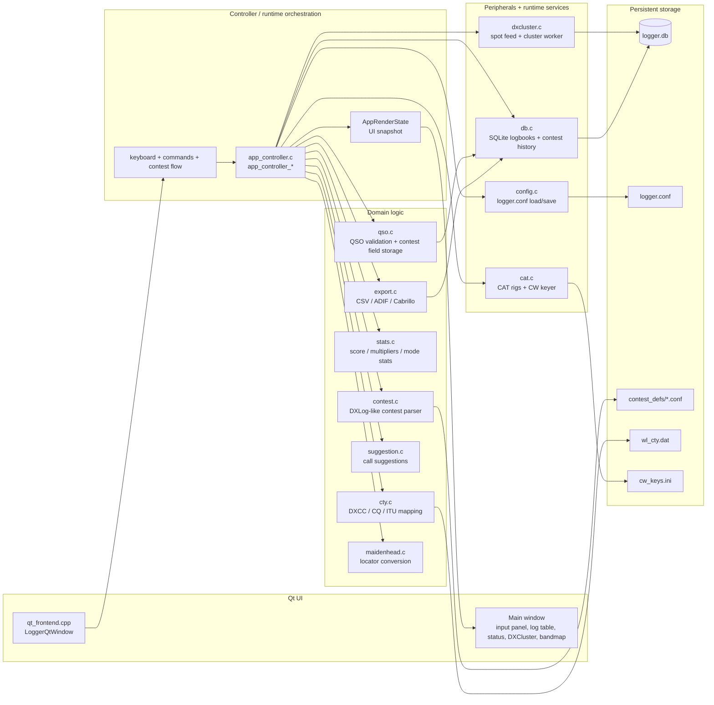

# Architektura i funkcjonalności zaimplementowane

## Cel systemu

Aplikacja jest narzędziem do prowadzenia logu amatorskiego z obsługą:

- QSO w trybie contestowym i non-contestowym,
- CAT / radia i DXCluster,
- dynamicznej wymiany EXCH,
- eksportu CSV / ADIF / Cabrillo,
- wielu nazwanych logów i automatycznego przywracania definicji zawodów po otwarciu logu.

## Główne warstwy

## Przepływ danych

### 1. Uruchomienie programu

- `config.c` ładuje `logger.conf`.
- jeśli domyślna definicja zawodów nie istnieje, aplikacja nie kończy startu; przechodzi w tryb bezcontestowy.
- `app_controller` inicjalizuje stan wejścia, radio, statusu i kontekstu logbooków.
- jeżeli w bazie zapisany jest aktywny log, jego metadane i definicja zawodów są przywracane po otwarciu.

### 2. Otwarcie logu

- `db_open_named_logbook_by_id()` i `db_open_named_logbook_by_name()` zmieniają aktywny logbook.
- `db_get_current_logbook_contest_path()` odczytuje zapisany plik definiujący zawody dla tego logu.
- `restore_current_log_contest_definition()` przywraca aktywną definicję po otwarciu logu, bez ręcznego re-selekcji.

### 3. Wpisywanie QSO

- pole `call` i `rst` są obsługiwane w kontrolerze i UI,
- `qso_add_contest_fields()` zapisuje `exchange_sent` i `exchange_recv`,
- `db_update_qso_contest_fields()` zapisuje dane do SQLite,
- numer kolejny wymiany jest generowany na podstawie danych z logu, nie z UI.

### 4. Zapis i eksport

- QSO trafia do aktywnego logbooka w SQLite,
- export CSV, ADIF i Cabrillo korzysta z aktualnie załadowanej definicji zawodów,
- Cabrillo pobiera nazwę zawodów, pola wymiany i metadane z `ContestDefinition`.

### 5. CW keyer i CAT

- `cat.c` obsługuje połączenie z portem keyera oraz sterowanie CW,
- prędkość keyera jest odczytywana i aktualizowana na bieżąco,
- CAT łączy z radio w pracy z dwoma slotami (SO2R / SO2V / SO1R).

## Zaimplementowane funkcjonalności

### Logowanie i UI

- obsługa QSO z podziałem na pola: `call`, `rst`, `comments`,
- tryb contestowy i non-contestowy,
- automatyczne przełączanie pól po spacji,
- podgląd aktualnej wysyłanej wymiany `EXCH` / `TX`,
- aktywne radio i stan RUN/S&P,
- widok statusu, DXCC, CQ / ITU, statystyk oraz sugestii wywołań,
- obsługa dziennika i historii wywołań w SQLite,
- nazwy logów i możliwość przełączania pomiędzy nimi,
- automatyczne przywracanie definicji zawodów po otwarciu logu.

### Definicje zawodów i wymiana

- ładowanie definicji zawodów w formacie DXLog-like,
- normalizacja plików `contest_defs/*.conf`,
- automatyczne wczytanie kontestu po otwarciu logu,
- obsługa `EXCHANGE_SENT=#` jako numeracji inkrementacyjnej,
- zapisywanie `exchange_recv` w QSO,
- przywracanie kolejnego numeru z logu, a nie z interfejsu,
- etykieta pola wymiany ustawiona na `EXCH`,
- walidacja pól wymiany zgodnie z definicją `FIELD` i nazwami pól typu `SERIAL`, `NR`, `ZONE`.

### CAT i DXCluster

- połączenie z radiem przez Hamlib (CAT),
- obsługa dwóch slotów CAT,
- odczyt trybu pracy z radia (opcjonalnie),
- monitorowanie DXCluster,
- wyświetlanie spotów i bandmapy,
- bezpieczne zatrzymanie workerów przy zamknięciu aplikacji,
- filtracja bandmapy i deduplikacja najbliższych spotów.

### CW keyer

- osobny keyer CW na porcie szeregowym,
- wybór linii `DTR` / `RTS`,
- kontrola prędkości CW w zakresie `1..60 WPM`,
- natychmiastowa aktualizacja prędkości bez restartu aplikacji,
- zapis do `logger.conf` oraz aktywacja na żywo.

### Statystyki i export

- statystyki QSO i multiplikatorów,
- zapis i odczyt metadanych logbooków,
- export do CSV, ADIF i Cabrillo,
- wsparcie dla QTC / WAE,
- import surowych definicji DXLog i konwersja do formatu lokalnego.

### Logbook / persistence

- SQLite jako magazyn logów i historii wywołań,
- wiele nazwanych logów w jednej bazie,
- archiwizacja i przywracanie poprzedniego logu,
- zapis ścieżki definicji zawodów przypisanej do aktywnego logbooka,
- niezawodna restauracja definicji po wznowieniu pracy z danym logiem.

### Stabilność runtime

- brak błędu startowego przy brakującym domyślnym pliku `contest.conf`,
- nieprzerwane ładowanie aplikacji bez błędów przy pustym `CONTEST_DEF_FILE`,
- poprawne zachowanie po otwarciu nowego lub wcześniejszego logu,
- brak wymuszonej walidacji „5 WPM” przy wprowadzaniu małych wartości.

## Zmiany w stosunku do wcześniejszych wersji

W aktualnej wersji dodatkowo wdrożono:

- automatyczne przywracanie definicji kontestu dla aktywnego logbooka,
- zapis `contest_definition_path` w `named_logbooks`,
- poprawienie ścieżki rozwiązywania definicji po otwarciu logu,
- poprawę persystencji `exchange_recv` i numeracji serialowej,
- poprawkę nazewnictwa pól `EXCH` / `EXCHANGE_SENT` w UI,
- natychmiastową zmianę prędkości CW z poziomu głównego okna,
- usunięcie błędów związanych z wprowadzaniem małych wartości WPM.
